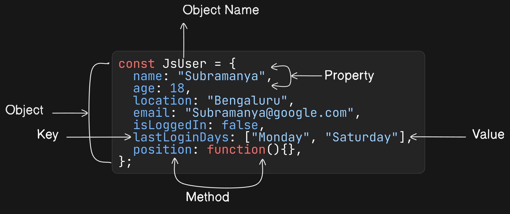

# Objects

In JavaScript, an object is like a container that can hold various properties (which are mutable) and methods (functions) as a single unit.

In JavaScript, an object is an unordered collection of key-value pairs. Each key-value pair is called a property.

1. Properties: Properties are the characteristics of an object. They are defined using a key-value pair. The key property is an identifier (either a name, a number, or a string literal) And the value of a property can be any value. (such as numbers, strings, arrays, other objects, or even functions).

2. Methods: Methods are functions that are stored as properties within an object. These functions can be executed (called) using the object they belong to. Methods allow objects to perform actions or behaviors. Methods are defined in the same way as properties, but their values are functions.

Javascript is an object-based language, everything in javascript is an object or can be made an object using a new keyword.

- Numbers can be made object using the new keyword
- Boolean can be made object using the new keyword
- Strings can be made object using the new keyword
- An array is an object
- A function is an object
- Date is an object
- Regex (Regular Expression) is an object
- Maths is an object
- Objects are always objects

## JavaScript Object structure



## Creating an Object

There are 5 ways to create objects in JavaScript

1. Object Literals (Object Initializers)
2. using new keyword
3. constructor function
4. Object.create()
5. ES6 classes
6. Factory Functions

**_Among all ways to create objects in javascript, the most common way is the object literal._**

## Object Literals

```JS
const obj = {
property1: value1, // property name may be an identifier
2: value2, // or a number
"property n": value3, // or a string
};
```

```JS
const JsUser = {
    name: "Subramanya",
    age: 18,
    location: "Bengaluru",
    email: "Subramanya@google.com",
    isLoggedIn: false,
    lastLoginDays: ["Monday", "Saturday"],
};
console.log(JsUser);

/*
    OUTPUT

    {
     name: 'Subramanya',
     age: 18,
     location: 'Bengaluru',
     email: 'Subramanya@google.com',
     isLoggedIn: false,
     lastLoginDays: [ 'Monday', 'Saturday' ]
    }
*/
```

## using `new` keyword

This method is similar to other class based language, ex Java. In this, the object is created using the ‘new’ keyword.

```JS
let person = new Object();
person.name = "K Subramanyeshwara";
person.age = 26;
person.getDetails = function(){
  return `${this.name} is ${this.age} years old`;
};

console.log(person.getDetails());

/*
    OUTPUT

    K Subramanyeshwara is 26 years old
*/
```

## Constructor function

When you want to create multiple objects where the objects share same design.

- Create an object by writing a constructor function.
- The function should have a parameter that is the object properties.
- Create an instance of the object with `new` keyword.

```JS
function Laptop(brand, processor, ram, gpu) {
    this.brand = brand;
    this.processor = processor;
    this.ram = ram;
    this.gpu = gpu;
}
// here brand, ram, cpu are the keys
const laptop1 = new Laptop("Lenovo", "AMD", 24, "1024mb");
const laptop2 = new Laptop("Dell", "Intel", 16, "1024mb");
console.log(laptop1);
console.log(laptop2);

/*
    OUTPUT

    Laptop { brand: 'Lenovo', processor: 'AMD', ram: 24, gpu: '1024mb' }
    Laptop { brand: 'Dell', processor: 'Intel', ram: 16, gpu: '1024mb' }

*/
```

Use the `prototype` property to add the methods to an object and this method is shared by all the objects created by constructor function.

```JS
function Person(firstname, lastname, age) {
  this.firstname = firstname;
  this.lastname = lastname;
  this.age = age;
}

Person.prototype.fullName = function() {
  return "My name is " + this.firstname + " " + this.lastname;
}

let person1 = new Person("K", "Subramanyeshwara", 25);

console.log(person1.fullName());

/*
    OUTPUT

    My name is K Subramanyeshwara
*/
```

## `Object.create()`

The `Object.create()` method is used to create an object from an existing object. It creates a new object with the same properties as the existing object.

It is a singleton object.

```JS
let person = {
  firstname: "steve",
  lastname: "jobs",
  fullName: function() {
    return "My name is " + this.firstname + " " + this.lastname;
  }
}
// create a new object
let newPerson = Object.create(person);
// printing just object
console.log(newPerson);// it will not show the properties because all the properties are hidden under prototype and can access them as regular properties.
console.log(newPerson.fullName());

// change the value of the new object
newPerson.firstname = "K";
newPerson.lastname = "Subramanyeshwara";

console.log(newPerson.fullName());

/*

    OUTPUT

    {}
    My name is steve jobs
    My name is K Subramanyeshwara
*/
```

## Using ES6 classes

ES6 supports class concept like any other object oriented language.

The class is used to create an object constructor.

There is difference between the class and the object constructor. All the difference is in their syntax

```JS
class Person {
  constructor(firstName, lastName, age) {
    this.firstName = firstName;
    this.lastName = lastName;
    this.age = age;
  }

  greet() {
    return `Hello, I'm ${this.firstName} ${this.lastName} and my age is ${this.age}`;
  }
}

const person = new Person('K', 'Subramanyeshwara', 26);
console.log(person.greet());

/*
    OUTPUT

    Hello, I'm K Subramanyeshwara and my age is 26
*/
```

## Accessing properties of Object

1. Using the dot operator.
2. Using the bracket operator.

**_dot operator_**

Using `dot operator` you can acess the properties of the object by writing the object's name, a dot (`.`), and the property name.

The dot operator is most commonly used to access the properties of an object.

```JS
const myCar = {
  make: "Ford",
  model: "Mustang",
  year: 1969,
};

console.log(myCar.make);
console.log(myCar.model);

/*
    OUTPUT

    Ford
    Mustang
*/
```

**_bracket operator_**

Another way to access the properties of an object is `bracket operator`.

It is useful when you are not sure about the properties name whether it contains white space or not.

```JS
let Laptop = {
   brand: "Samsung",
   "processor": "Snapdragon",
    "RAM": 24,
    gpu : "1024mb"
};

console.log(Laptop["brand"]);
console.log(Laptop["processor"]);
console.log(Laptop["RAM"]);

/*
    OUTPUT

    Samsung
    Snapdragon
    24
*/
```

**_Difference between dot (.) and bracket ( [ ] ) notations_**

Dot Notation only allows static keys while Bracket Notation accepts dynamic keys.

Static key here means that the key is typed directly,

Dynamic key here means that the key is evaluated from an expression.

Read More on [freeCodeCamp](https://www.freecodecamp.org/news/dot-notation-vs-square-brackets-javascript/#:~:text=Differences%20between%20Dot%20Notation%20and,is%20evaluated%20from%20an%20expression.)

**_Using symbol as object-key_**

```JS
const mySymbl = Symbol("Key");

const Laptop = {
   brand: "Samsung",
   "processor": "Snapdragon",
   "RAM": 24,
    gpu: "1024mb",
    [mySymbl]: "myKey"
};

console.log(Laptop[mySymbl]);
console.log(Laptop);

/*
  OUTPUT

  myKey
  {
   brand: 'Samsung',
   processor: 'Snapdragon',
   RAM: 24,
   gpu: '1024mb',
   [Symbol(Key)]: 'myKey'
  }
*/
```

## Updating an existing properties of an Object

```JS
const Laptop = {
   brand: "Samsung",
   "processor": "Snapdragon",
   "RAM": 24,
    gpu: "1024mb",
};
console.log(Laptop);

//dot noatation
Laptop.gpu = "2048mb";
console.log(Laptop);

//bracket notation
Laptop["processor"] = "AMD";
console.log(Laptop);

/*
  OUTPUT

  { brand: 'Samsung', processor: 'Snapdragon', RAM: 24, gpu: '1024mb' }
  { brand: 'Samsung', processor: 'Snapdragon', RAM: 24, gpu: '2048mb' }
  { brand: 'Samsung', processor: 'AMD', RAM: 24, gpu: '2048mb' }
*/
```

**_Handling the non-existing property_**

Retrieving the property which does not exist inside the obj will return undefined.

```JS
let person = {
   first_name: "K Subramanyeshwara"
};

console.log(person.first_name);
console.log(person.last_name);

/*
  OUTPUT

  K Subramanyeshwara
  undefined
*/
```

## Adding new properties to an Object

```JS
const Person = {
    firstName: "K",
    lastName: "Subramanyeshwara",
    age: 26,
    location: "Bengaluru",
    email: "k@remote.com"
}
console.log(Person);

//dot notation
Person.socialMediaPresence = true;
console.log(Person);

//bracket notation
Person["married"] = false;
console.log(Person);

/*
  OUTPUT

  {
   firstName: 'K',
   lastName: 'Subramanyeshwara',
   age: 26,
   location: 'Bengaluru',
   email: 'k@remote.com'
  }
  {
   firstName: 'K',
   lastName: 'Subramanyeshwara',
   age: 26,
   location: 'Bengaluru',
   email: 'k@remote.com',
   socialMediaPresence: true
  }
  {
   firstName: 'K',
   lastName: 'Subramanyeshwara',
   age: 26,
   location: 'Bengaluru',
   email: 'k@remote.com',
   socialMediaPresence: true,
   married: false
  }
*/
```

## Deleting properties from an Object

We can delete the property using `delete` operator. If the property is not present then it will simply ignore it.

```JS
const Car = {
    name: "Ford",
    color: "Red",
    price: "$100000",
    topSpeed: "220kph"
}
console.log(Car);
delete Car.price;
console.log(Car);

/*
  OUTPUT

  { name: 'Ford', color: 'Red', price: '$100000', topSpeed: '220kph' }
  { name: 'Ford', color: 'Red', topSpeed: '220kph' }
*/
```

## Property value shorthand

Using existing variables as values for property names.

```JS
function makeUser(name, age){
 return{
   name: name,
   age: age,
   // ...
 };
}

let user = makeUser("Rohit", 35);
console.log(user.name);
```

In the example above, properties have the same names as variables. It is so common that there’s a special property value shorthand to make it shorter.

```JS
function makeUser(name, age) {
  return {
    name, // same as name: name
    age,  // same as age: age
    // ...
  };
}
```

## Property names limitations

We already know that we can't use keywords as an identifier. But for an object property, there’s no such restriction

```JS
// these properties are all right
let obj = {
  for: 1,
  let: 2,
  return: 3
};

console.log( obj.for + obj.let + obj.return );  // 6
```

In short, there are no limitations on property names. They can be any strings or symbols (a special type for identifiers, to be covered later).

Other types are automatically converted to strings. For instance, a number 0 becomes a string "0" when used as a property key

```JS
let obj = {
  0: "test" // same as "0": "test"
};

// both alerts access the same property (the number 0 is converted to string "0")
console.log( obj["0"] ); // test
console.log( obj[0] ); // test (same property)
```

## Checking if property or method exist in object

JavaScript allows to access the property of the object and there will be no error if the property doesn’t exist!

Reading a non-existing property just returns `undefined`. So we can easily test whether the property exists or not

**_using `in` operator_**

`in` operator will check whether the given property exist or not. It will look for the property in the prototype chain also.

```JS
"key" in object
```

```JS
const User = {
    fullName: "K Subramanyeshwara",
    age: 26,
    gender: "male",
    getDetails: function () {
        return`name is ${this.fullName}, the age is ${this.age} and the gender is ${this.gender}`;
    }
}

console.log(User.fullName);
console.log(User.salary)
console.log(User.getDetails());
console.log("fullName" in User);
console.log("getDetails" in User);

/*
  OUTPUT

  false
  true
  true
  true
*/
```

Please note that on the left side of in there must be a `property name`. That’s usually a quoted string.

**_Why do we need `in` operator_**

```JS
let obj = {
  test: undefined
};

console.log( obj.test ); // it's undefined, so - no such property?
console.log( "test" in obj ); // true, the property does exist!
```

Situations where `undefined` is assigned in that case `in` operator needed but one shouldn't explicitly assign `undefined`

## The "for..in" loop

To go over all keys of an object, there exists a special form of the loop: `for..in` This is a completely different thing from the `for(;;)`

```JS
for (key in object) {
  // executes the body for each key among object properties
}
```

```JS
let user = {
  name: "John",
  age: 30,
  isAdmin: true
};

for (let key in user) {
  // keys
  console.log( key );  // name, age, isAdmin
  // values for the keys
  console.log( user[key] ); // John, 30, true
}

for (let prop in user) {
    console.log(user[prop])
}
```

## Is object ordered?

Object is ordered in a special fashion: integer properties are sorted, others appear in creation order.

```JS
let codes = {
  49: "Germany",
  41: "Switzerland",
  44: "Great Britain",
  userExist: true,
  1: "USA",
  userSocialHandle: false,
  userSalary: 10000,
};

for (let code in codes) {
  console.log(code); // 1, 41, 44, 49
}

/*
  OUTPUT

  1
  41
  44
  49
  userExist
  userSocialHandle
  userSalary
*/
```

If we want the objet to apear in the listed order we can add `+` sign before each code is enough.

```JS
let codes = {
  "+49": "Germany",
  "+41": "Switzerland",
  "+44": "Great Britain",
  // ...,
  "+1": "USA",
};

for (let code in codes) {
  console.log(code);
}

/*
  OUTPUT

  49
  41
  44
  1
*/
```
