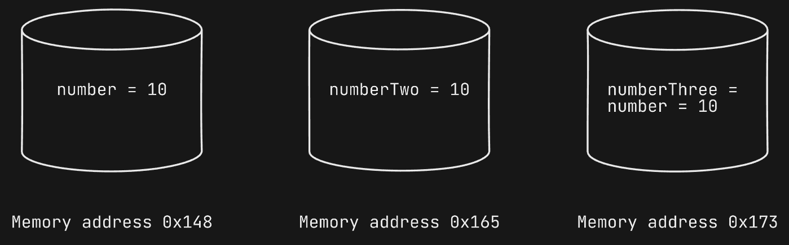
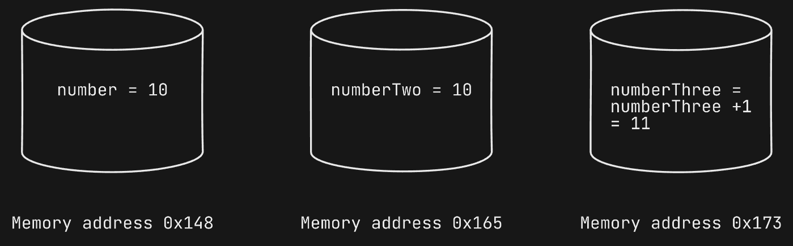
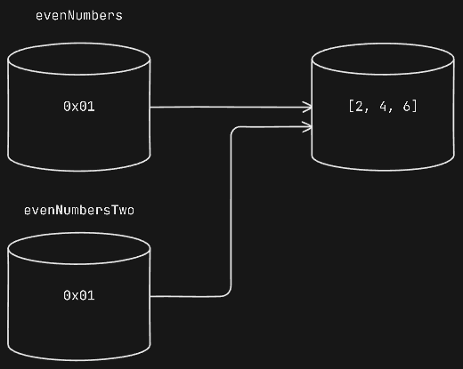
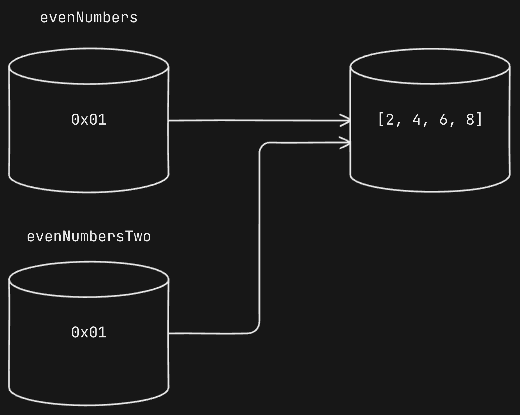
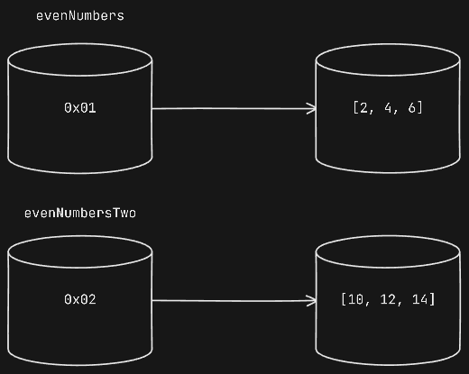
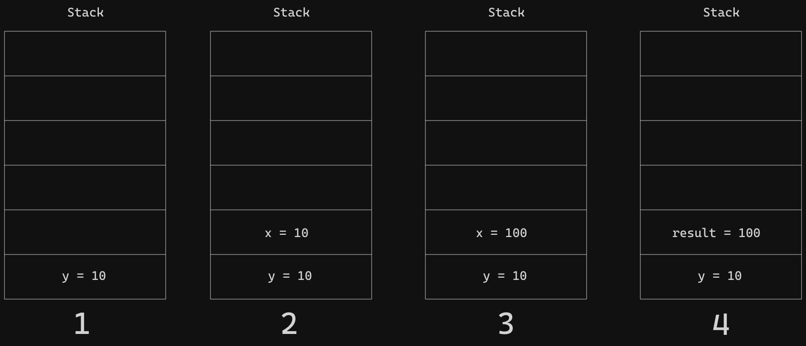
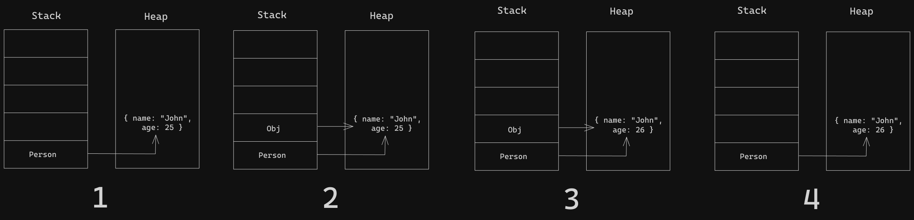

# JavaScript function are first-class citizens

you can store functions in variables, pass them to other functions as arguments, and return them from other functions as values.

```JS
function sum(a, b) {
  return a + b;
}
let add = sum;
console.log(add);
// calling the function in two ways
add = sum(2, 4); // normal way
let resultOne = add(2, 4); // assigned way
console.log(add);
console.log(resultOne);

// passing function to another function
function avarage(a, b, fn) {
  return fn(a, b) / 2;
}
let resultTwo = avarage(10, 20, add);
let resultThree = avarage(10, 20, sum);
console.log(resultTwo);
console.log(resultThree);
```

**putting altogether**

```JS
function multiply(a, b) {
  return a * b;
}
let multi = multiply;
function multiplyAverage(a, b, multi) {
  return multi(a, b) / 2;
}
let multiResult = multiplyAverage(5, 4, multi);
console.log(multiResult);
```

## Returning functions from functions

Since functions are values, you can return a function from another function.

```JS
function compareBy(propertName) {
  return function (a, b) {
    let x = a[propertName];
    let y = b[propertName];
    if (x > y) {
      return 1;
    } else if (x < y) {
      return -1;
    } else {
      return 0;
    }
  };
}

let products = [
  {
    productName: "Samsung",
    price: 1500,
    year: 2023,
  },
  {
    productName: "Lava",
    price: 500,
    year: 2024,
  },
  {
    productName: "Apple",
    price: 1800,
    year: 2022,
  },
  {
    productName: "Google",
    price: 1000,
    year: 2024,
  },
];

console.log("Product sorted by Name: ");
products.sort(compareBy("productName"));
console.table(products);
```

# Anonymous Function

A function that are declared without a name. They are often used when the function is used only once and does not need to be reused.

```JS
(function (params) {
   // Function Body
})();
```

> if you don’t place the anonymous function inside the parentheses `()`, you’ll get a syntax error. The parentheses `()` make the anonymous function an expression that returns a function object.

> Anonymous functions can be assigned to a variable, passed as an argument to another function, or used as a value in an expression. Example is `function expression`

### Types of Anonymous Function

- IIFE - Immediately invoked function execution
- Arrow functions

**IIFE - Immediately invoked function execution**

If you want to execute a function immediately after it is declared, you can wrap the function in parentheses and add an additional set of parentheses. This is called immediate invocation or immediately executed function expression (IIFE).

They are often used to create a private scope and avoid polluting the global namespace.

```JS
(function () {
  console.log("I am IIFE");
})();
```

**_passing arguments into an anonymous function_**

```JS
let person = {
  firstName: "Jhon",
  lastName: "Smith",
};

(function () {
  console.log(
    `Employee first name is ${person.firstName} and the last name is ${person.lastName}`
  );
})();
```

**Arrow functions**

Arrow Function is introduced in ES6 (ECMAScript 2015) and provide a more compact syntax compared to traditional function expressions. Arrow function is defined but not immidiatly invoked. You can assign it to a variable or return it from another function.

Arrow functions do not have their own `this` binding. Instead, they inherit the `this` value from the enclosing scope. This makes arrow functions particularly useful when working with callback functions or methods that require a specific `this` value.

```JS
// single line arrow function
const add = (a, b) => a + b;
console.log(add(2, 3)); // Output: 5
```

```JS
// Multi-line arrow function
const multiply = (a, b) => {
  const result = a * b;
  return result;
};
console.log(multiply(2, 3)); // Output: 6
```

### Using anonymous functions as arguments

In reality, You often pass anonymous functions as argumnets to other functions.

```JS
setTimeout(function () {
  console.log("Executed after 5 seconds");
}, 5000);
```

### Advantages

- Concise Code: Anonymous functions are great for writing concise code, especially when you need a small, one-time-use function.
- Reduced Memory Usage: Anonymous functions use less memory than named functions because they don't require storing a reference to the function in memory.
- Scope Encapsulation: They can be used to encapsulate functionality within a local scope without cluttering the global scope.

### Disadvantages

- Limited Debugging: Since anonymous functions are not assigned to a variable, debugging can be more challenging, especially when trying to understand complex code.
- Readability: Anonymous functions can make code less readable, especially when they are used extensively or nested within other functions.
  -No Reusability: Anonymous functions cannot be reused in other parts of your code without redefining them.

### When to Use

- One-time-use Functions: Use anonymous functions when you need a small, one-time-use function that doesn't require reusability or debugging ease.
- Concise Code: Use anonymous functions when you want to write concise code and don't mind the potential drawbacks.
- Small Callbacks: Use anonymous functions as callbacks in event listeners or timeouts where you only need a small, one-time-use function.
- Immediate execution: Anonymous functions can be used to execute code immediately, without the need for a named function.

### When Not to Use

- Reusable Functions: Avoid using anonymous functions for reusable functions that require debugging ease or reusability.
- Complex Logic: Don't use anonymous functions for complex logic or algorithms that require readability and maintainability.
- Recursive functions: Anonymous functions can lead to confusion when used for recursive functions, as they do not have a name that can be easily referenced within the function.
- Large-Scale Applications: In large-scale applications, it's generally better to avoid anonymous functions in favor of named functions for easier maintenance and debugging.

# JavaScript pass-by-value or pass-by-reference

On a high level we can say that,

- `pass-by-value` means passing a actual value.
- `pass-by-reference` means passing a reference instead of actual value.

Before understanding what is `pass-by-value` and `pass-by-reference`, let's understand the different data types and how different data types stored in memory.

There are 2 types of data types are there in JavaScript

1. Primitive data types
   - String
   - Number
   - Bigint
   - Boolean
   - Undefined
   - Null
   - Symbol
   - Object
2. Non-primitive data types
   - objects
   - arrays
   - date
   - maps
   - sets

### Primitive data types

In primitive data types variable stores actual value. and each primitive data types stored in a separate memory space.

Which means when you assign a variable to another variable copy of the value will be assigned not the memory address.

```JS
let number = 10;
let message = "Hi";
let numberTwo = 10;
let numberThree = number;
```

| Identifier  | Value |
| ----------- | ----- |
| number      | 10    |
| message     | Hi    |
| numberTwo   | 10    |
| numberThree | 10    |



What will happen when you update the primitive value?

```JS
let number = 10;
let message = "Hi";
let numberTwo = 10;
let numberThree = number;
numberThree = numberThree + 1;
```

| Identifier  | Value |
| ----------- | ----- |
| number      | 10    |
| message     | Hi    |
| numberTwo   | 10    |
| numberThree | 11    |



### Non-primitive data types

When a non-primitive data type is created it is stored in a heap memory. Heap memory is a region of the memory which is used for dynamic memory allocation.

When a non-primitive data type is created, a reference to that data type is stored on the stack, while the actual data is stored in the heap.

```JS
let evenNumbers = [2, 4, 6];
let evenNumbersTwo = evenNumbers;
```

| Identifier     | Value  | Address | Value     |
| -------------- | ------ | ------- | --------- |
| evenNumbers    | <0x01> | <0x01>  | [2, 4, 6] |
| evenNumbersTwo | <0x01> |         |           |



In the above example you can see that value stores the reference to memory address, not the actual value.

When we assign a variable to another variable copy of the address will be assigned to it not the value and new variable will refer to same memory address.

```JS
let evenNumbers = [2, 4, 6];
let evenNumbersTwo = evenNumbers;
evenNumbersTwo.push(8)
```

| Identifier     | Value  | Address | Value        |
| -------------- | ------ | ------- | ------------ |
| evenNumbers    | <0x01> | <0x01>  | [2, 4, 6, 8] |
| evenNumbersTwo | <0x02> | <0x02>  | [2, 4, 6, 8] |



In non-primitive data types if you change the value for any one variable the value will be changed to all the variables having the same reference.

```JS
evenNumbersTwo = [10, 12, 14]
```

| Identifier     | Value  | Address | Value        |
| -------------- | ------ | ------- | ------------ |
| evenNumbers    | <0x01> | <0x01>  | [2, 4, 6, 8] |
| evenNumbersTwo | <0x02> | <0x02>  | [10, 12, 14] |



When you rewriting the variable with the new value it will use the different memory address to store the value.

We understood how Primitive and Non-Primitive data types are stored in the memory. We can easily understand the difference between `pass-by-value` and `pass-by-reference` now.

If you want a quick summery then

`pass-by-value` is Primitive data types and `pass-by-reference` is Non-Primitive data types. Lets take example and understand both.

## pass-by-value

```JS
function square(x){
  x = x * x;
  return x;
}

let y = 10;
let result = square(y);
console.log(y); // 10
console.log(result); // 100
```

1. First declare `square(x)` function which accepts `x` as parameter and returns `x` after calculating the value of the `x`.

2. Next declare `y` variable and assign value `10`. Then pass the `y` variable to `square(y)` function. Once we pass the `y` variable to `square(y)` function value of the `y` variable is copied into `x`.

3. `square(x)` function will calculate the value of `x` and returns it. Now the value of `x` is `100` and value of `y` is `10` because primitive values always copies the value not the reference.

4. Then the `result` variable is updated with the `x` value which is `100`



## pass-by-reference

```JS
let person = {
  name: 'John',
  age: 25,
};
console.log(person);

function increaseAge(obj) {
  obj.age += 1;
}
increaseAge(person);

console.log(person);
```

1. First we define an object called `person` with two properties `name` and `age`.

2. Next, we define `increaseAge(obj)` function which takes `obj` as parameter and increases the `age` property of `obj` argument. Then, we pass the `person` object into `increaseAge(obj)` function. When the `person` is passed into `increaseAge(obj)` function `obj` will also point to same reference as `person` object.

3. After that `age` property of `person` object is increased inside the `increaseAge(obj)` function via `obj` variable.

4. Finally, accessing the object via the `person` object.



> when passing an object to a function, you are passing the reference of that object, not the actual object. Therefore, the function can modify the properties of the object via its reference. However, you cannot change the reference passed into the function.

```JS
let person = {
  name: 'John',
  age: 25,
};

function increaseAge(obj) {
  obj.age += 1;

  // reference another object
  obj = { name: 'Jane', age: 22 };
}

increaseAge(person);

console.log(person);
```
