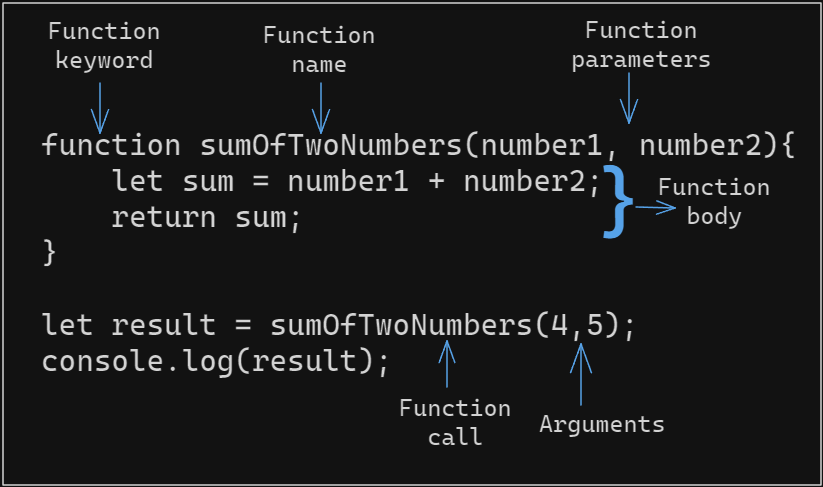

# Functions

Functions are one of the fundamental building blocks of JavaScript.

A function is a set of instructions that performs a specific task. Functions are used to break down a program into smaller, reusable pieces.

Function is made up of sequence of statements called the function body.
Values can be passed to a function as parameters, and the function will return a value.

In JavaScript functions are [first-class object](https://developer.mozilla.org/en-US/docs/Glossary/First-class_Function) , What distinguishes them from other objects is that functions can be called.

## Function Structure



## Declaring a function

There are many wasy to create functions in JavaScript.

1. Function Declaration
2. Function Expression
3. Function Constructor
4. Immediately Invoked Function Expression (IIFE)
5. Named Function Expression
6. Arrow Function Expression (ES6+)
7. ES6+ Method Declaration (Class Methods)
8. Generator Function (ES6+)

***Function Declaration***

```JS
function greet(name) {
  return `Hello, ${name}!`;
}
```

***Function Expression***

```JS
const greet = function(name) {
  return `Hello, ${name}!`;
};
```

***Function Constructor***

```JS
const greet = new Function('name', 'return `Hello, ${name}!`');
console.log(greet("Sumanth"));
```

***Immediately Invoked Function Expression (IIFE)***

```JS
(function() {
  const message = "I'm an IIFE!";
  console.log(message);
})();
```

***Named Function Expression***

```JS
const multiply = function multiplyNumbers(a, b) {
  return a * b;
};
```

***Arrow Function Expression (ES6+)***

```JS
const greet = (name) => {
  return `Hello, ${name}!`;
};
```

***ES6+ Method Declaration (Class Methods)***

```JS
class Calculator {
  add(a, b) {
    return a + b;
  }
}
```

***Generator Function (ES6+)***

```JS
function* countToThree() {
  yield 1;
  yield 2;
  yield 3;
}
```

## Calling a function

To call a function write function name followed parenthesis and the arguments that you want to pass to the function.

If there is no parameter then write blank parenthesis.

```JS
function hello() {
  console.log("Hello World!");
}
// Function call
hello();

/*
    OUTPUT

    Hello World!
*/
```

## function parameter/arguments

***function parameter***

function parameter declared inside the parentheses(). function parameter is used inside the function body.

***function arguments***

The actual values that are passed while calling a function.

1. When a number of arguments are less than parameters then the rest parameters will be undefined
2. when the number of arguments are more than parameters then extra arguments will be ignored

```JS
function fullName(firstname, lastname) {
  console.log(firstname + " " + lastname);
}
fullName("Stephen", "Hawking");
fullName("Stephen", "William", "Hawking");
fullName("Stephen");

/*
    OUTPUT

    Stephen Hawking
    Stephen William
    Stephen undefined
*/
```

## function return

`return` keyword is used to return the values to the function call.

The function stops execution when reached to return statement even if there are more statements in the function after a return.

The return value can be stored in a variable.

```JS
function multiply(a, b) {
  return a * b;
}
var value = multiply(4, 6);
console.log("Multiplication of 2 numbers:",value);

/*
    OUTPUT

    Multiplication of 2 numbers: 24
*/
```

you can use a return statement without returning any value just to stop the execution of the function.

>using `console.log()` in the function dosen't mean it will return value of the function. It will just print it in the console.

***specifying default value to the function parameter***

```JS
function userLoginMessage(username = "user") {
    return `${username} just logged in`;
}
let result = userLoginMessage("Subramanyeshwara");
let result1 = userLoginMessage();
console.log(result);
console.log(result1);

/*
    OUTPUT

    Subramanyeshwara just logged in
    user just logged in
*/
```

```JS
function printValue(a=1, b) {
    console.log("a = " + a + " and b = " + b);
}

printValue();
printValue(7);
printValue(7, 3);

/*
    OUTPUT

    a = 1 and b = undefined
    a = 7 and b = undefined
    a = 7 and b = 3    
*/
```

***passing multiple values to an function***

Using rest operator we can pass multiple values to the single parameter of the function.

```JS
function calculateCartPrice(...cartItems) {
    return cartItems;
}
let cartItems = calculateCartPrice(500, 700, 300, 900);
console.log(cartItems);
// We can also use rest operator after taking some values
function calculateCartPrice1(cartItems1, cartItems2, ...cartItemsN) {
    return cartItemsN;
}
let cartItems1 = calculateCartPrice1(500, 700, 300, 900);
console.log(cartItems1);

/*
    OUTPUT

    [ 500, 700, 300, 900 ]
    [ 300, 900 ]
*/
```

***Passing Object into a function***

```JS
const user = {
    userName: "K Subramanyeshwara",
    userAge: 26
}
function handleObject(anyObject) {
    // return `User name is ${anyObject.userName} and User age is ${anyObject.userAge}`;
    console.log(`User name is ${anyObject.userName} and User age is ${anyObject.userAge}`);
}
// let functionReturn = handleObject(user);
// console.log(functionReturn);
handleObject({
    userName: "Ramya",
    userAge: 31
});

/*
    OUTPUT

    User name is K Subramanyeshwara and User age is 26 
    User name is Ramya and User age is 31
*/
```

***Passing Array into a function***

```JS
const studentScore = [87, 72, 95, 74, 91, 83];

function handleArray(anyArray) {
    return `Student score for 3rd subject is ${anyArray[2]}`;
}

// const functionReturn = handleArray(studentScore);
// console.log(functionReturn);
console.log(handleArray([67, 48, 98, 75]));

/*
    OUTPUT

    Student score for 3rd subject is 95
    Student score for 3rd subject is 98
*/
```
