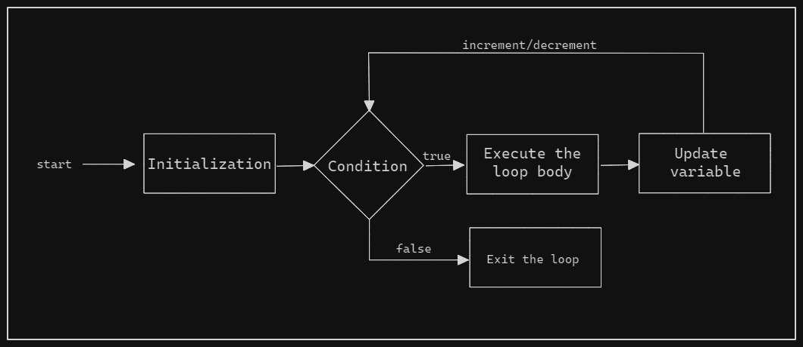
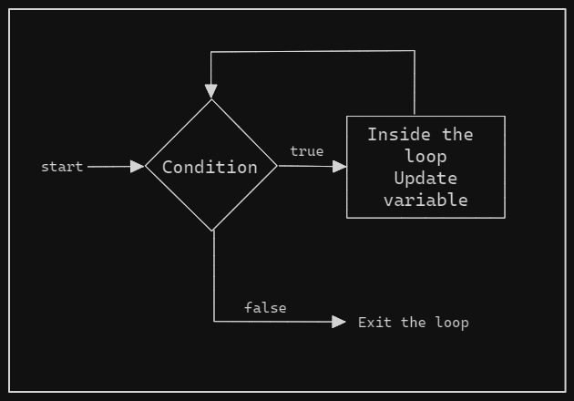
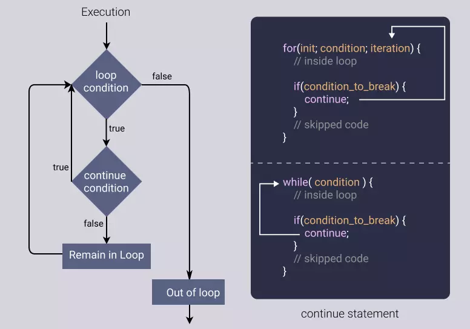

# Loops

Loops helps you to execute a block of code frequently until a specific condition is met.

## Category of loops

- Entry Controlled Loop

    Condition is tested before entering the loop. If the condtion is true then only the loop will be executed. Once the condition become false execution will sto.

  - for loop
  - while loop

- Exit Controlled Loop

    Condition is tested at the end of the loop after executing the body of the Loop at least once. In this loop will be executed atleast once irrespictive if condition is true or not. If the condition is met, the Loop will continue to run, once condition become false execution will stop.

  - do...while

## Types of loops

1. for
2. while
3. do...while
4. for...in/for...off

## for loop

For loop used when we know the number of iterations. It will repeat the block of code till the condition is true and when the condition becomes false then the loop will be terminated .

It has three components

- initialization,
- condition, and
- increment/decrement, all separated by semicolons.



```JS
for (let i = 0; i < 5; i++) {
  console.log(i);
}

/*
    OUTPUT

    0
    1
    2
    3
    4
*/
```

In the above example,

- First counter variable is initialized,
- then counter variable is compared with the condition
- if the condtion is true then loop will be executed and counter varible will be updated
- if the condition is false then control will exit from the loop.

***Nested for loop***

Using `for loop` inside an `for loop`

```JS
const height = 5;
for (let i = 1; i <= height; i++) {
    for (let j = 1; j <= i; j++) {
        process.stdout.write("* ")
    }
    console.log();
}

/*
  OUTPUT

  *
  * *
  * * *
  * * * *
  * * * * *

*/
```

## while loop

While loops are useful when you are uncertain about the number of iterations in advance. such as reading data from a stream.

It will execute a block of code repeatedly until given condtion is true. When the given condition becomes false loop will get terminated.



```JS
/* Printing number from 1 to 5 */
let count = 1;
while (count <= 5) {
    console.log(count);
    count++;
}

/* Printing number from 5 to 1 */
let count1 = 5;
while (count1 >= 1) {
    console.log(count1);
    count1--;
}

/*
  OUTPUT

  1
  2
  3
  4
  5

  5
  4
  3
  2
  1
*/
```

```JS
/* Traversing array value */
let superHeros = ["Iron Man", "Thor", "Hulk", "Captain America", "Flash", "Batman"];

while (superHeros.length < superHeros.length + 1) {
    console.log(superHeros);
    superHeros++;
}

/*
  OUTPUT

  [ 'Iron Man', 'Thor', 'Hulk', 'Captain America', 'Flash', 'Batman' ]
*/
```

## do while loop

It will execute a block of code repeatedly until given condtion is true. When the given condition becomes false loop will get terminated.

In the do-while loop, the condition is checked after executing the loop. So, even if the condition is false, the code block will be executed for at least one time.


```JS
let num = 5;
do {
    console.log(num);
    num++;
} while (num < 5);

/*
  OUTPUT

   5
*/
```

In the above example,

You can see even if the condition is false, loop is executed atleast once.

## break and continue

`break` and `continue` are the flow control statements within loops.

***break***

`break` statement terminates the current loop or switch statement.

When a `break` statement is encountered inside `loop` or `switch`, it will immediatly transfers program control to the next statement which is outside the `loop` or `switch`.


```JS
//using for loop
for (let i = 1; i <= 10; i++){
    if (i === 5) {
        break;
    }
    console.log(i);
}

//using switch case
let x = 2;
switch (x) {
    case 1:
        console.log("x = 1");
        break;
    case 2:
        console.log("x = 2");
        break;
    case 3:
        console.log("x = 3");
        break;
    default:
        console.log("nothing match");
}

/*
  OUTPUT
  1
  2
  3
  4
  x = 2
*/
```

***continue***

The continue statement is used to skip the current iteration of the loop and jump to the next iteration.

It is useful when you want to skip certain iterations based on a condition, but you don't want to exit the loop entirely.



```JS
//Skip even numbers in a loop
for (let i = 0; i < 10; i++) {
    if (i % 2 === 0) {
        continue;
    }
    console.log(i);
}

//Skip odd numbers in a loop
let i = 0;
while (i <= 10) {
    i++;
    if (i % 2 === 0) {
        console.log(i);
    }
    continue;
}

/*
  OUTOPUT

  1
  3
  5
  7
  9
  2
  4 
  6
  8
  10
*/
```
