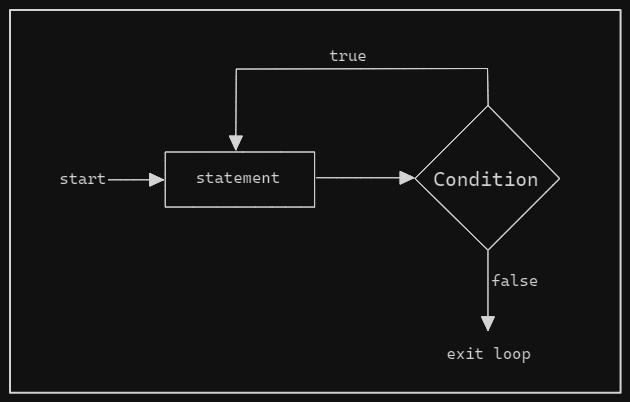
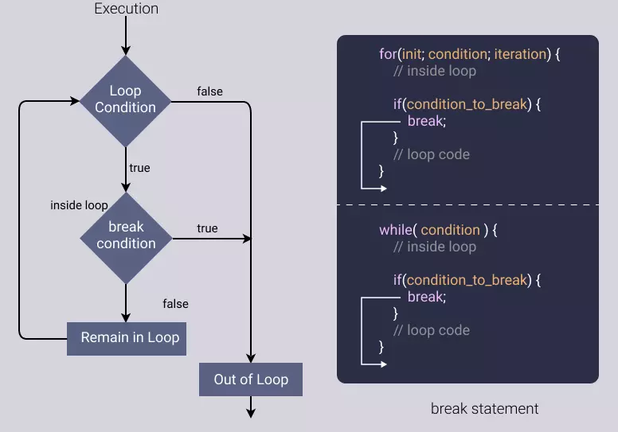

# Loops

Loops helps you to execute a block of code frequently until a specific condition is met.

## Category of loops

- Entry Controlled Loop

    Condition is tested before entering the loop. If the condtion is true then only the loop will be executed. Once the condition become false execution will sto.

  - for loop
  - while loop

- Exit Controlled Loop

    Condition is tested at the end of the loop after executing the body of the Loop at least once. In this loop will be executed atleast once irrespictive if condition is true or not. If the condition is met, the Loop will continue to run, once condition become false execution will stop.

  - do...while

## Types of loops

1. for
2. while
3. do...while
4. for...in/for...off

## for loop

For loop used when we know the number of iterations. It will repeat the block of code till the condition is true and when the condition becomes false then the loop will be terminated .

It has three components

- initialization,
- condition, and
- increment/decrement, all separated by semicolons.


```JS
for (let i = 0; i < 5; i++) {
  console.log(i);
}

/*
    OUTPUT

    0
    1
    2
    3
    4
*/
```

In the above example,

- First counter variable is initialized,
- then counter variable is compared with the condition
- if the condtion is true then loop will be executed and counter varible will be updated
- if the condition is false then control will exit from the loop.

***Nested for loop***

Using `for loop` inside an `for loop`

```JS
const height = 5;
for (let i = 1; i <= height; i++) {
    for (let j = 1; j <= i; j++) {
        process.stdout.write("* ")
    }
    console.log();
}

/*
  OUTPUT

  *
  * *
  * * *
  * * * *
  * * * * *

*/
```

## while loop

While loops are useful when you are uncertain about the number of iterations in advance. such as reading data from a stream.

It will execute a block of code repeatedly until given condtion is true. When the given condition becomes false loop will get terminated.


```JS
/* Printing number from 1 to 5 */
let count = 1;
while (count <= 5) {
    console.log(count);
    count++;
}

/* Printing number from 5 to 1 */
let count1 = 5;
while (count1 >= 1) {
    console.log(count1);
    count1--;
}

/*
  OUTPUT

  1
  2
  3
  4
  5

  5
  4
  3
  2
  1
*/
```

```JS
/* Traversing array value */
let superHeros = ["Iron Man", "Thor", "Hulk", "Captain America", "Flash", "Batman"];

while (superHeros.length < superHeros.length + 1) {
    console.log(superHeros);
    superHeros++;
}

/*
  OUTPUT

  [ 'Iron Man', 'Thor', 'Hulk', 'Captain America', 'Flash', 'Batman' ]
*/
```

## do while loop

It will execute a block of code repeatedly until given condtion is true. When the given condition becomes false loop will get terminated.

In the do-while loop, the condition is checked after executing the loop. So, even if the condition is false, the code block will be executed for at least one time.



```JS
let num = 5;
do {
    console.log(num);
    num++;
} while (num < 5);

/*
  OUTPUT

   5
*/
```

In the above example,

You can see even if the condition is false, loop is executed atleast once.

## break and continue

`break` and `continue` are the flow control statements within loops.

***break***

`break` statement terminates the current loop or switch statement.

When a `break` statement is encountered inside `loop` or `switch`, it will immediatly transfers program control to the next statement which is outside the `loop` or `switch`.



```JS
//using for loop
for (let i = 1; i <= 10; i++){
    if (i === 5) {
        break;
    }
    console.log(i);
}

//using switch case
let x = 2;
switch (x) {
    case 1:
        console.log("x = 1");
        break;
    case 2:
        console.log("x = 2");
        break;
    case 3:
        console.log("x = 3");
        break;
    default:
        console.log("nothing match");
}

/*
  OUTPUT
  1
  2
  3
  4
  x = 2
*/
```

***continue***

The continue statement is used to skip the current iteration of the loop and jump to the next iteration.

It is useful when you want to skip certain iterations based on a condition, but you don't want to exit the loop entirely.


```JS
//Skip even numbers in a loop
for (let i = 0; i < 10; i++) {
    if (i % 2 === 0) {
        continue;
    }
    console.log(i);
}

//Skip odd numbers in a loop
let i = 0;
while (i <= 10) {
    i++;
    if (i % 2 === 0) {
        console.log(i);
    }
    continue;
}

/*
  OUTOPUT

  1
  3
  5
  7
  9
  2
  4 
  6
  8
  10
*/
```

## for...of

'for...of' loop allows you to iterate over iterable objects (arrays, sets, maps, strings etc).

The 'for...of' loop works with any iterable object, and it automatically terminates when all elements in the iterable have been processed. It won't work with Objects.

```JS
for (varible of iterable){
    //statement
}
```

- variable: A variable that represents the current element's value in each iteration.
- iterable: An iterable object, that represents sequence of values on which the loop operates.
- statement: A statement to be executed on every iteration.

***Iterating Over an Array***

```JS
//Iterating over an array
const evenNumbers = [2, 4, 6, 8, 10];
for (const eveNumbs of evenNumbers) {
    console.log(eveNumbs);
}

//iterating over string
let greetings = "Hello World";
for (const greet of greetings) {
    if (greet === " ") {
        continue;
    }
    console.log(greet);
}

//Iterating Over a Map
const myMap = new Map();
myMap.set('name', 'John');
myMap.set('age', 30);
for (const [key, value] of myMap) {
    console.log(`${key}: ${value}`);
}

/*
    OUTPUT
    2
    4
    6   
    8
    10
    H
    e
    l
    l
    o
    W
    o
    r
    l
    d
    name: John
    age: 30
*/
```

## for...in

'for...of' loop allows you to iterate over the [enumerable](https://www.geeksforgeeks.org/what-does-enumerable-property-mean-in-javascript/) properties of an object.

```JS
for (variable in object){
    //statement
}
```

- variable: A variable that represents the current element's value in each iteration.
- object: Name of an object whose properties will be iterated through.
- statement: A statement to be executed on every iteration.

```JS
//using object
const programName = {
    js: 'JavaScript',
    py: 'Python',
    rb: 'Ruby'
}
//to get key
for (const key in programName) {
    console.log(key);
}
//to get value of an object
for (const key in programName) {
    console.log(programName[key]);
}
// to get and value of an object
for (const key in programName) {
    console.log(`${key} is shortcut for ${programName[key]}`);
}

//using array
const oddNumbers = [1, 3, 5, 7, 9];
//to get keys
for (const key in oddNumbers) {
    console.log(key);
}
//to get values
for (const key in oddNumbers) {
    console.log(oddNumbers[key]);
}
/*
    OUTPUT

    js
    py
    rb
    JavaScript
    Python
    Ruby
    js is shortcut for JavaScript
    py is shortcut for Python
    rb is shortcut for Ruby
    
    0
    1
    2
    3
    4

    1
    3
    5
    7
    9
*/
```

## Array.forEach()

It is a higher-order function that loops through an array and calls a callback function for each element. It is also considered as method on the array.

The callback function can perform any operation on the element, such as logging it to the console, modifying it in place, or returning a new value.

>Array.forEach() will not return any value.

```JS
array.forEach(function(currentValue, index, array) {
  // code to be executed for each element
});
```

- currentValue: The current element being processed in the array.
- index (optional): The index of the current element being processed.
- array (optional): The array that forEach() is being called on.

```JS
let myStates = ["Karnataka", "Andra Pradesh", "Goa", "Tamilnadu", "Telangana", "Kerala"]

//Normal function
myStates.forEach(function (state) {
    console.log(state);
});
console.log();
//arrow function
myStates.forEach((state) => {
    console.log(state);
});
console.log();
//
let printMe = (item) => {
    console.log(item);
}
myStates.forEach(printMe)
/*
    OUTPUT

    Karnataka
    Andra Pradesh
    Goa
    Tamilnadu
    Telangana
    Kerala

    Karnataka
    Andra Pradesh
    Goa
    Tamilnadu
    Telangana
    Kerala

    Karnataka
    Andra Pradesh
    Goa
    Tamilnadu
    Telangana
    Kerala
*/
```

***Accessing objects inside an array***

```JS

/*
    OUTPUT

    
*/
```
