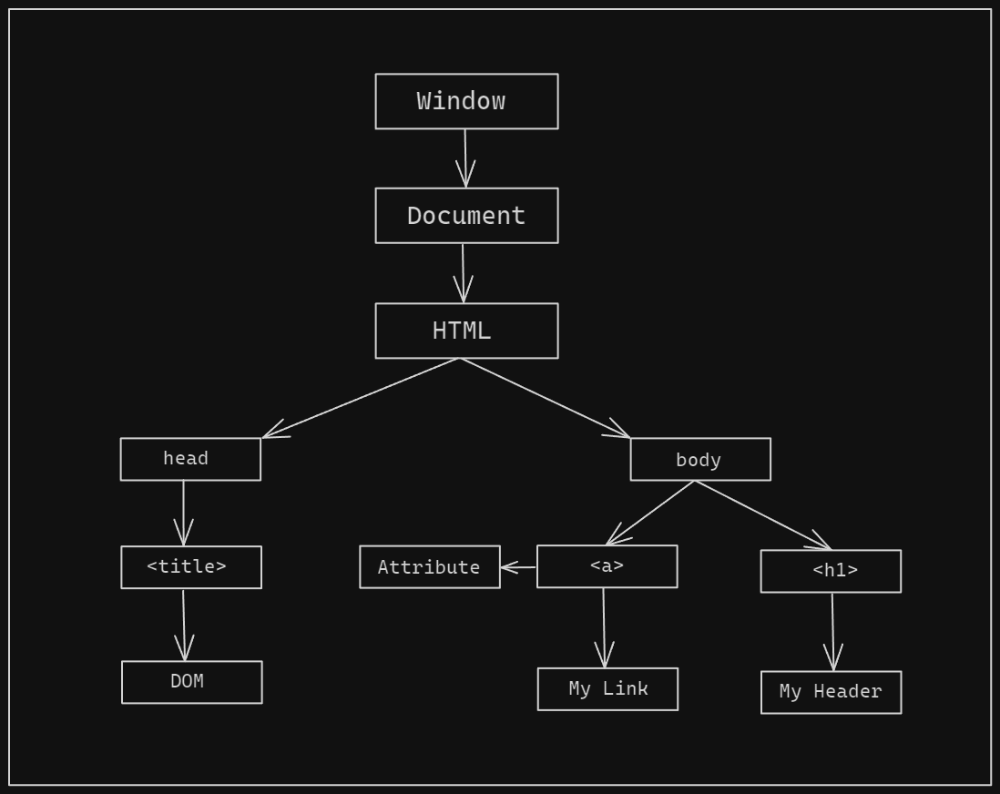

# Document Object Model (DOM)

DOM is an application programming interface (API) that represents the structure of an HTML or XML document. It provides a way for developers to interact with and manipulate the content, structure, and style of a web page.

DOM defines HTML and XML documents as tree like structure, where each element in the document is represented as a node. These nodes can be accessed, modified, added, or removed using JavaScript methods and properties.

## HTML DOM tree

## Accessing/Selecting Elements

You can access/select elements in the DOM using JavaScript. Common methods are

- `document.getElementById()`: Finding an element by their id.
- `document.getElementsByClassName()`: Finding an element by their class name.
- `document.getElementsByTagName()`: Finding an element by their tag name.
- `document.querySelector()`: Finds the first element matching a CSS selector.
- `document.querySelectorAll()`: Finds all elements matching a CSS selector.

## Traversing elements

## Manipulating elements

## Working with Attributes

## Manipulating Element’s Styles
