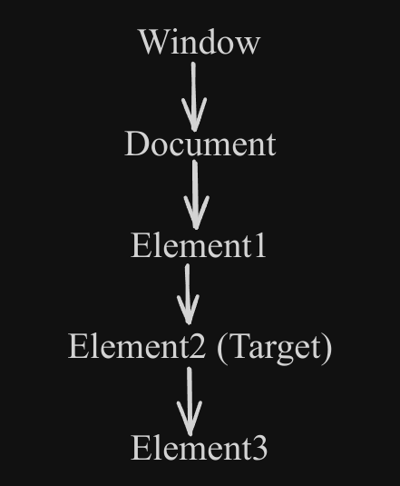

# Events

An event is an action or a state of any action performed either by the user or by the browser. An event can be triggered by the user (clicking a button, scrolling the page, or pressing a key on the keyboard) or by the browser (completion of an AJAX request, the page finishing loading, or a web socket connection being established). Events allows you to create dynamic and interactive experiences.

- The browser triggers an event when the user interacts with the browser.
- The user triggers an event when the user interacts with the webpage.

**Example**
You might want to display an alert when a user clicks a button.

## Types of Events

- Mouse
- Keyboard
- Form
- Drag and drop
- Clipboard
- Window
- Network
- Media
- Animation
- Touch
- Progress
- Websocket

**Mouse Events**:
These events are triggered by the mouse.

- `click`: The mouse button is clicked.
- `dblclick`: The mouse button is double-clicked.
- `mousedown`: The mouse button is pressed down.
- `mouseup`: The mouse button is released.
- `mousemove`: The mouse is moved.
- `mouseover`: The mouse is moved over an element.
- `mouseout`: The mouse is moved out of an element.
- `contextmenu`: The context menu is triggered (usually by a right-click).

**Keyboard Events**:
These events are triggered by the keyboard.

- `keydown`: A key is pressed down.
- `keyup`: A key is released.

**Form Events**:
These events are triggered by form elements.

- `submit`: A form is submitted.
- `reset`: A form is reset.
- `input`: The value of an `input`, `select`, or `textarea` element is changed.
- `change`: The value of an `input`, `select`, or `textarea` element is changed and the - element loses focus.
- `focus`: An element gains focus (usually by being clicked on or tabbed to).
- `blur`: An element loses focus (usually by the focus being moved to another element).

**Document/Window Events**:
These events are triggered by the document or the window.

- `load`: The document has finished loading.
- `unload`: The document is being unloaded (usually when the user navigates away from the page).
- `resize`: The window is resized.
- `scroll`: The window or an element is scrolled.

**Drag and Drop Events**:
These events are triggered by drag-and-drop actions.

- `dragstart`: The user starts to drag an element.
- `drag`: The user is dragging an element.
- `dragend`: The user has finished dragging an element.
- `dragenter`: An element is dragged over a valid drop target.
- `dragover`: An element is being dragged over a valid drop target.
- `dragleave`: An element is no longer being dragged over a valid drop target.
- `drop`: An element is dropped on a valid drop target.

**Clipboard Events**:
These events are triggered by clipboard actions.

- `cut`: The user cuts the selected content.
- `copy`: The user copies the selected content.
- `paste`: The user pastes the content from the clipboard.

**Media Events**:
These events are triggered by media elements, like `audio` and `video`.

- `play`: The media starts to play.
- `pause`: The media is paused.
- `ended`: The media has ended.
- `timeupdate`: The current playback position has changed.

**Animation Events**:
These events are triggered by CSS animations and transitions.

- `animationstart`: A CSS animation has started.
- `animationiteration`: A CSS animation has repeated.
- `animationend`: A CSS animation has ended.
- `transitionend`: A CSS transition has ended.

**Network Events**:
These events are triggered by network actions, like fetching a resource or creating a WebSocket connection.

- `online`: The browser has gone online.
- `offline`: The browser has gone offline.
- `load`: A resource has finished loading.
- `error`: An error has occurred while loading a resource.
- `open`: A WebSocket connection has been established.
- `message`: A message has been received on a WebSocket connection.
- `close`: A WebSocket connection has been closed.

**Touch Events**:

- `touchstart`: Fired when the user starts touching an element with their finger (on touch-enabled devices).
- `touchmove`: Fired when the user moves their finger over an element.
- `touchend`: Fired when the user stops touching an element.
- `touchcancel`: Fired when the user cancels a touch event (e.g., by lifting their finger off the screen).

**Websocket Events**:

- `open`: Connection has been opened.
- `message`: Message is received through a WebSocket.
- `error`: An error occurs.
- `close`: Connection has been closed.

**Progress Events**:

- `loadstart`: Progress has begun on the loading of a resource.
- `progress`: Periodic updates on the progress of loading a resource.
- `loadend`: Progress has stopped on the loading of a resource.

## Handling Events

When an event is triggered the browser will call the function/piece of code that will execute to respond to that event.

This function/piece of code called as event handler or event listener. It listens to the event and responds accordingly to the event fires.

Event can be handled by multilple event handlers. If an event has multiple event handlers, all the event handlers will be executed when the event is fired. The event handlers are called in the exact order they are attached to the element.

**Adding Event Handlers/Listener**:

An event listener is a function that gets called when a specific event occurs, such as a click, mouseover, or keypress.

1. Inline Event Handlers (Using on\* attributes)
2. Event Listeners with addEventListener()
3. Using the attachEvent() method (for Internet Explorer)

**Inline Event Handlers (Using on\* attribute)**

```HTML
<button onclick="handleClick()">Click Me</button>
```

```JS
function handleClick() {
  alert("Button Clicked");
}
```

> the `this` value inside the event handler is equivalent to the event’s target element

```HTML
<input type="button" value="Save" onclick="alert(this.value)">
```

> the event handler can access the element’s properties

```HTML
<input type="button" value="Save" onclick="alert(value)" />
<input type="button" value="Save" ondblclick="alert(type)" />
```

Assigning event handlers using HTML event handler attributes is considered a bad practice and should be avoided as much as possible for the following reasons:

- The event handler code is mixed with the HTML code, which will make the code more difficult to maintain and extend.

- It is a timing issue. If the element is loaded fully before the JavaScript code, users can start interacting with the element on the webpage which will cause an error.

**Event Listeners with addEventListener()**

It is used to attach an event handler to a specific element/node.

```JS
element.addEventListener(event, function, useCapture);
```

- `element`: This is the DOM element to which you want to attach the event listener.
- `event`: This is a string representing the event type you want to listen for.
- `function`: This is the function that will be called when the specified event occurs.
- `useCapture `(optional): This is a boolean value (true or false) that controls the event propagation phase in which the event handler is triggered. By default, it's false (bubbling phase).

```HTML
<button id="click">Click Me</button>
```

```JS
function handleClick() {
  alert("Button Clickedd");
}

let click = document.getElementById("click");
click.addEventListener("click", handleClick);
```

## Event Flow

It describes the order in which events are received on the DOM (Document Object Model) when an event occurs.

**Event Flow process**:

- Capture Phase
- Target Phase
- Buble Phase

**Capture Phase**:
The capture phase starts at the topmost element (the document object) and works its way down to the targeted element.

**Target Phase**:
In this phase event reaches the target element. This is the element which triggered the event.

- The targeted element's event handler is executed, if defined.
- If no event handler is present on the targeted element, the event continues to bubble up the DOM tree.

**Bubble Phase**:
After reaching the target the event moves from the innermost element to the outer elements. Event handlers registered for this phase execute as the event travels up the tree.



## Event Propagation

Event Propagation is a mechanism/process deciding how an event travel through the DOM tree when an event occurs. It is a process of deciding when and in which direction the event will be executed. It is a way to define the order in which the event occurs.

- Bubbling
- Capturing
- Delegation

```HTML
<p id="para">
    <span id="strong">Lorem ipsum dolor, <button type="button" id="btn">click me</button></span> sit amet consectetur
    adipisicing elit. Expedita optio, ea tempora magni non iure quas sed
    distinctio quam! Non totam accusamus veritatis architecto inventore,
    culpa doloribus. Corporis, dolorem id.
</p>
```

**Event bubbling**

It is a default process. An event starts from the most specific element and move towards the least specific element (the document or even window).

```JS
let para = document.querySelector("#para");
let strong = document.querySelector("#strong");
let btn = document.querySelector("#btn");
para.addEventListener("click", () => {
  console.log("You have clicked on Paragraph");
});
strong.addEventListener("click", () => {
  console.log("You have clicked on strong text");
});
btn.addEventListener("click", () => {
  console.log("You have clicked on btn");
});
```

An event first occurs on `button` element that was clicked. Then the event goes up the DOM tree, firing on each event along its way until it reaches the `window` object.


### What is the differences between event.currentTarget, event.target and this.target

**event.currentTarget**

It refers to the element that is currently being processed by the event handler. If there are nested elements involved then it may not refer to the original target.

**event.target**

It refers to the original element that triggered the event. It is the element that was clicked, focused, hovered, or otherwise interacted with.

**this.target**

Inside an event listener function, `this` usually refers to the element that is currently being processed by the event handler just like `event.currentTarget` in most cases.

```JS
function clik(event) {
  alert(
    `You clicked on ${event.currentTarget.tagName} and ${event.target.tagName} and ${this.tagName}`
  );
}
```

**Event Capturing**

An event starts from the least specific element and move downward toward the most specific element.

```JS
para.addEventListener(
  "click",
  () => {
    console.log("You have clicked on Paragraph");
  },
  {
    capture: true,
  }
);
strong.addEventListener(
  "click",
  () => {
    console.log("You have clicked on strong text");
  },
  {
    capture: true,
  }
);
btn.addEventListener(
  "click",
  () => {
    console.log("You have clicked on btn");
  },
  {
    capture: true,
  }
);
```

An event first occurs on `p` element even though `button` element was clicked. Then the event goes down the DOM tree, firing on each event along its way until it reaches the last event.


**`stopPropagation()`**

If I want only the clicked element to trigger the event, not any other elements? You have to use `stopPropagation()` method within event handler.

```JS
para.addEventListener("click", (e) => {
  console.log("You have clicked on Paragraph");
  e.stopPropagation();
});
strong.addEventListener("click", (e) => {
  console.log("You have clicked on strong text");
  e.stopPropagation();
});
btn.addEventListener("click", (e) => {
  console.log("You have clicked on btn");
  e.stopPropagation();
});
```

**`preventDefault()`**

It is used to prevent the default behavior of an event. Let's understand by an example.

```HTML
<form action="" id="loginForm">
  <label for="username">Username:</label>
  <input type="text" id="username" name="username" />
  <label for="password">Username:</label>
  <input type="password" id="password" name="password" />
  <button type="submit">Login</button>
</form>
```

```JS
document.querySelector("#loginForm").addEventListener("submit", (e) => {
  e.preventDefault();
  alert("Form submission prevented.");
});
```

**Event Delegation**

It is a technique to handle events efficiently. Instead of adding event listener to each element we directly add event listener to the parent element and use `.target` property of event object to call an event on perticular element. This method uses event bubbling technique to match all the child events.

```HTML
<ul id="itemList">
  <li>Apple</li>
  <li>Banana</li>
  <li>Cat</li>
  <li>Dog</li>
</ul>
```

```JS
let itemList = document.querySelector("#itemList");
itemList.addEventListener("click", (e) => {
  if (e.target.tagName === "LI") {
    alert(e.target.textContent);
  }
});
let newLi = document.createElement("li");
newLi.textContent = "Elephant";
itemList.appendChild(newLi);
```
