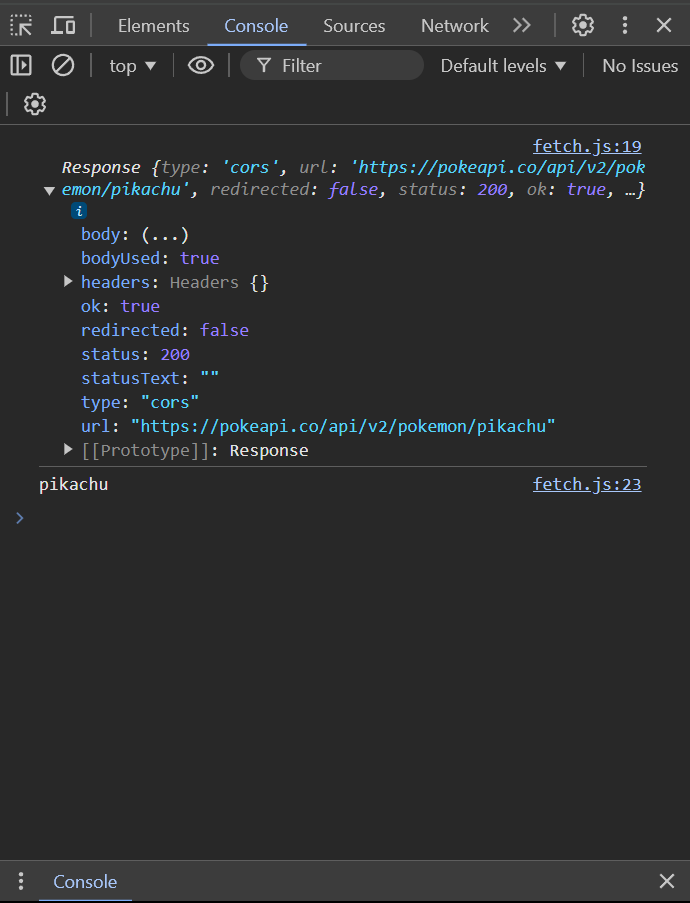
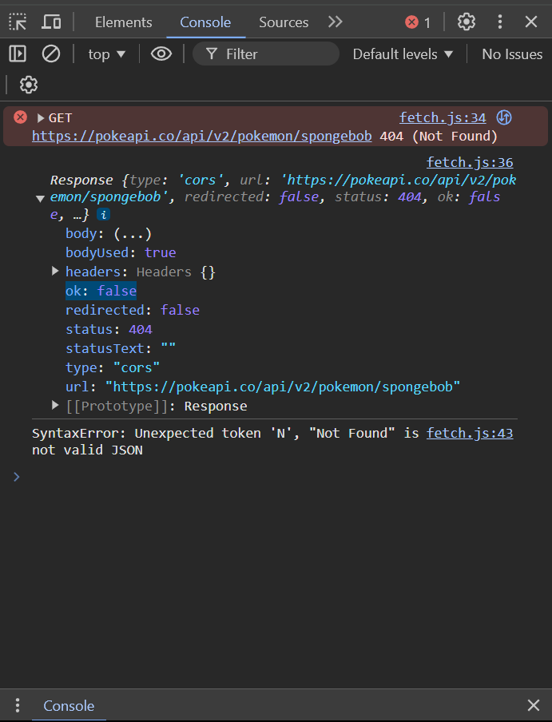
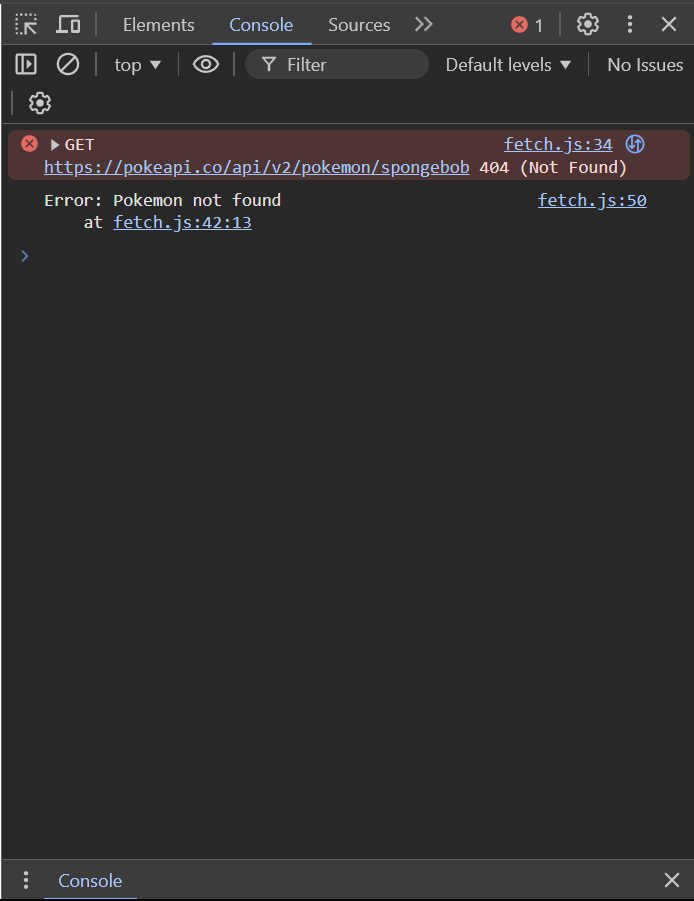
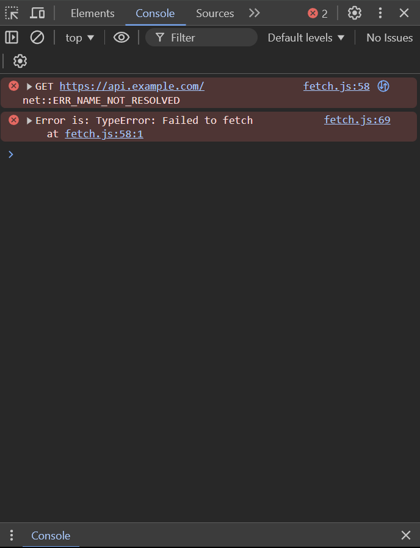
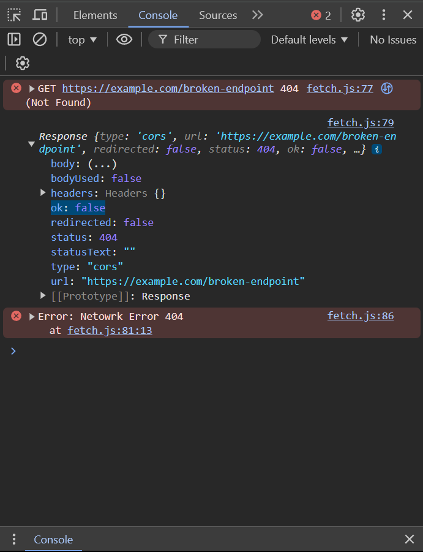

# fetch()

Fetch is a built-in JavaScript API that allows you to make network requests (like GET, POST, PUT, DELETE) to servers. It returns Promises, making it easy to handle asynchronous operations in a more readable and maintainable way.

## Why fetch()

- Simple and clean syntax compared to XMLHttpRequest
- Built-in Promise support for better handling of asynchronous operations
- More powerful and flexible API for controlling requests and responses
- Better error handling with the ok property and catch() method
- Streamlined approach to working with JSON data

## Errors in fetch()

1. HTTP Errors (Status Codes)
2. Network Errors
3. Timeout Errors
4. CORS Errors
5. Abort Errors
6. Type Errors (e.g., passing a non-string URL to fetch())
7. Syntax Errors (e.g., invalid JSON response data)

### HTTP Errors (Status Codes)

Errors that are related to server responses indicated by HTTP status codes.

HTTP errors do not reject the `fetch()` promise. Instead, the promise resolves, but the `response.ok` property will be `false`. You need to check the response status manually.

**Common HTTP Status Codes**

**2xx (Success)**
The request was successful, and the server returned the desired data.

Examples:

- **200 OK**: The request succeeded.
- **201 Created**: The resource was created successfully.
  Resolved or Rejected? Resolved
- **204 No Content**: The request succeeded, but there is no content to return.

Resolved or Rejected? Resolved (`response.ok` will be `true`)

```JS
fetch("https://pokeapi.co/api/v2/pokemon/pikachu")
  .then((response) => {
    console.log(response);
    return response.json();
  })
  .then((data) => {
    console.log(data.name);
  })
  .catch((error) => {
    console.log(error);
  });
```



**4xx (Client Errors)**

There was an issue with the request from the client (e.g., invalid URL, missing authentication).

Examples:

- `400 Bad Request`: The server cannot process the request due to client error.
- `401 Unauthorized`: Authentication is required.
- `403 Forbidden`: You do not have permission to access the resource.
- `404 Not Found`: The requested resource does not exist.

Resolved or Rejected? Resolved (but `response.ok` will be `false`)

```JS
fetch("https://pokeapi.co/api/v2/pokemon/spongebob")
  .then((response) => {
    // if (response.ok === false) {
    //   throw new Error("Pokemon not found");
    // } else {
    //   return response.json();
    // }
    if (!response.ok) {
      throw new Error("Pokemon not found");
    }
    return response.json();
  })
  .then((data) => {
    console.log(data.name);
  })
  .catch((error) => {
    console.log(error);
  });
```





**5xx (Server Errors)**

The request was valid, but the server encountered an error.

Examples:

- `500 Internal Server Error`: The server encountered an unexpected condition.
- `503 Service Unavailable`: The server is temporarily unavailable.
- `504 Gateway Timeout`: The server did not receive a timely response.
  Resolved or Rejected? Resolved (but `response.ok` will be `false`)

```JS
fetch("https://api.example.com") // Assume this URL causes a 500 Internal Server Error
  .then((response) => {
    if (!response.ok) {
      // 5xx error handling
      throw new Error(`Server error! status: ${response.status}`);
    }
    return response.json();
  })
  .then((data) => console.log(data))
  .catch((error) => {
    // This block catches both server errors (thrown in the previous block) and network errors (like a timeout)
    console.error("Error is:", error);
  });
```



### Network Errors

Network errors occur when there are issues with the network itself (e.g., no internet connection, DNS issues). These errors cause the `fetch()` promise to reject and trigger the `.catch()` block.

Examples:

- `DNS Issues`: The domain cannot be resolved.
- `Network Timeout`: The request takes too long to respond.
- `Connection Refused`: The server is refusing the connection.

Resolved or Rejected? Rejected

```JS
fetch("https://example.com/broken-endpoint")
  .then((response) => {
    console.log(response);
    if (!response.ok) {
      throw new Error(`Netowrk Error ${response.status}`);
    }
    // handle response
  })
  .catch((error) => {
    console.error(error); // Error: HTTP Error 500
  });
```


